# Nawerny E-learning Mobile App (Pfa2)

## Demo  
👉 [Watch the Demo Video](https://drive.google.com/file/d/11vznXPEHPZ8eklsjmKcGLbPguj2wmpET/view?usp=sharing)

**Nawerny E-learning** is an inclusive mobile application specially designed to make digital education **accessible to visually impaired users**.  
The project leverages **Flutter** (mobile frontend), **Django** (backend), and **MongoDB** (database) to deliver a complete, scalable, and accessible learning platform.  

---

## Key Features  
- **Voice Accessibility**: Navigation with screen reader support and voice commands.  
- **Interactive Courses**: Accessible and easy-to-read educational content.  
- **Simplified Interface**: User-friendly design with accessibility-first principles.  
- **Inclusion**: Promotes equal access to education for all.  

---

## Tech Stack  
- **Frontend Mobile**: Flutter  
- **Backend API**: Django REST Framework  
- **Database**: MongoDB  
- **Authentication**: JWT (JSON Web Tokens)  
- **Deployment**: Docker / Heroku / Render (configurable)  

---

## Installation & Setup  

### 1️⃣ Clone the repository  
```bash
git clone https://github.com/username/nawerny-elearning.git
cd nawerny-elearning
````

### 2️⃣ Backend (Django + MongoDB)

```bash
cd backend
pip install -r requirements.txt
python manage.py migrate
python manage.py runserver
```

### 3️⃣ Frontend (Flutter)

```bash
cd frontend
flutter pub get
flutter run
```

---

## Screenshots

### 🔹 App Initialization

<p align="center">
  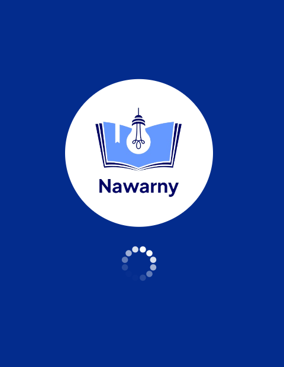
</p>

---

### 🔹 Authentication Flow

<p align="center">
  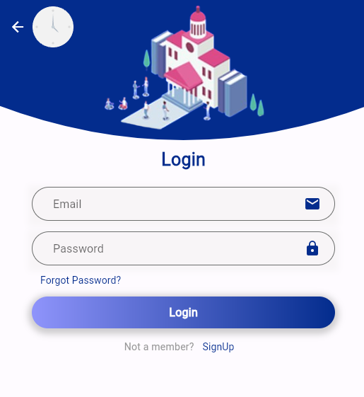
  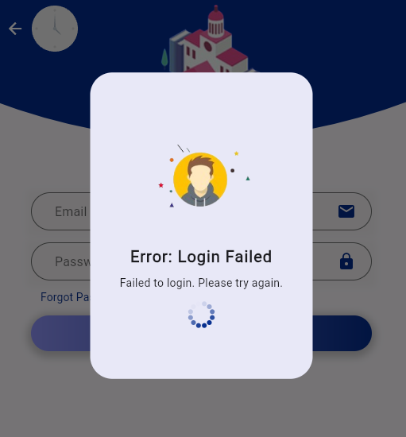
  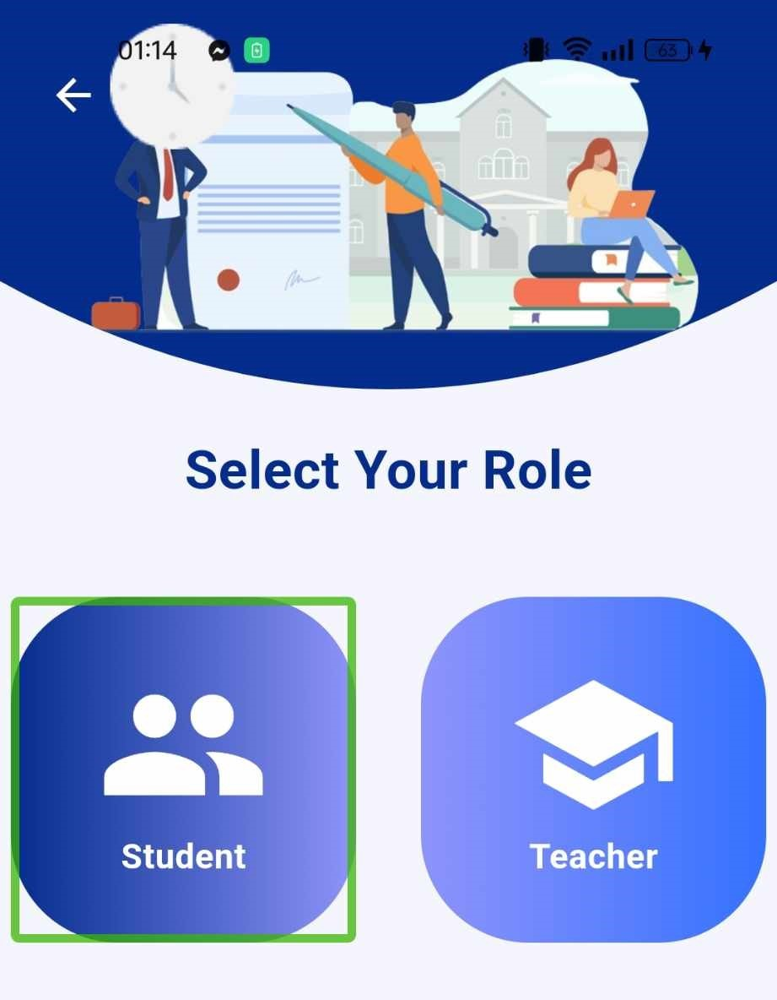
  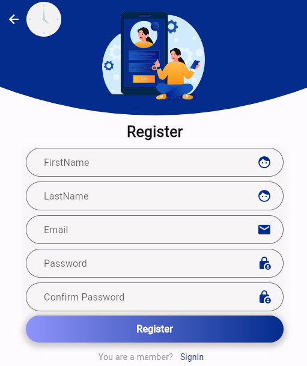
  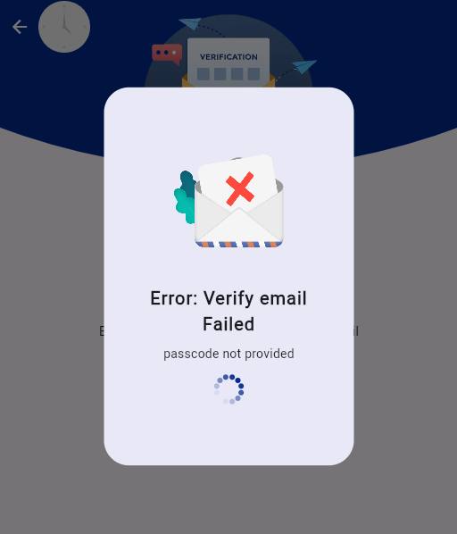
  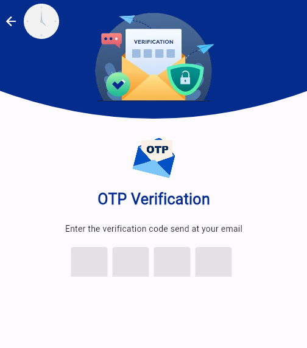
  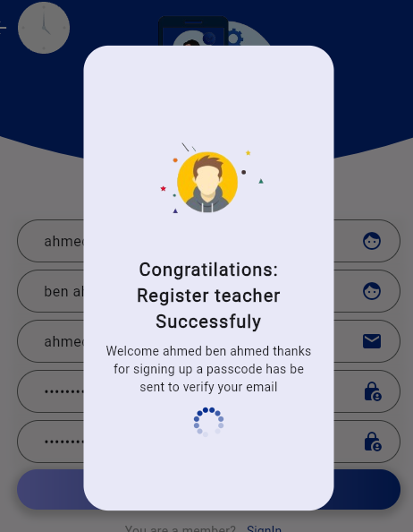
  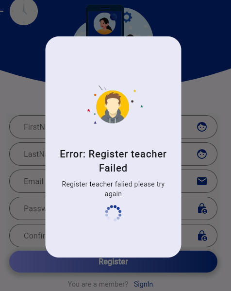
  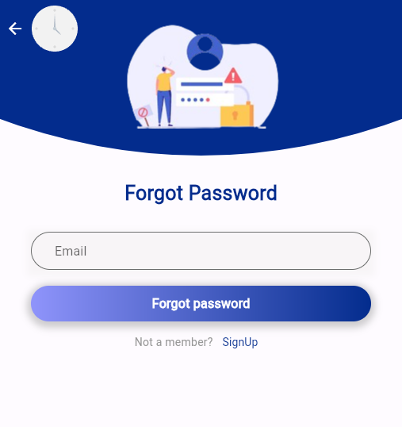
  
</p>

---

### 🔹 User Profile & Dashboard

<p align="center">
  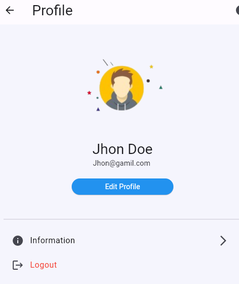
  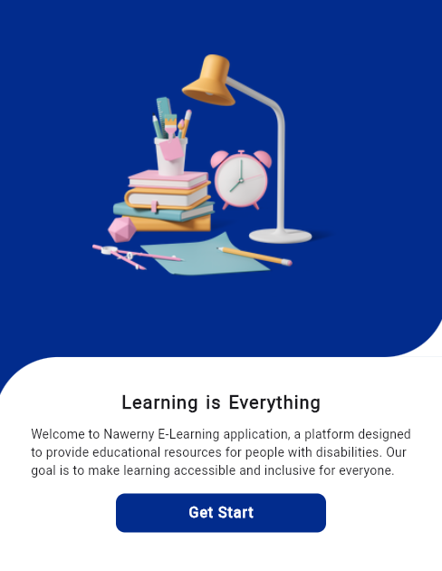
</p>

---

### 🔹 Courses & Content

<p align="center">
  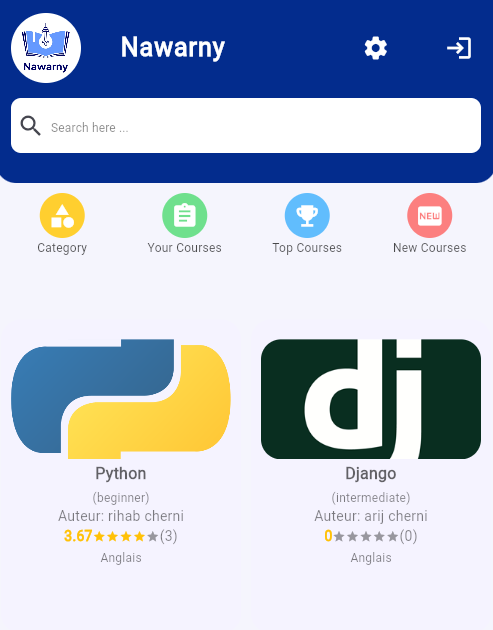
  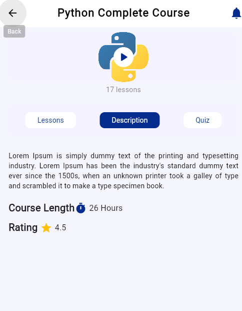
  
</p>

<p align="center">
  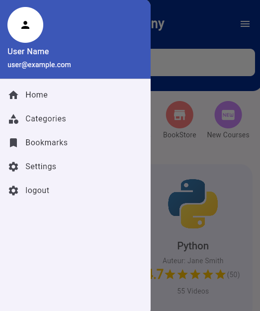
  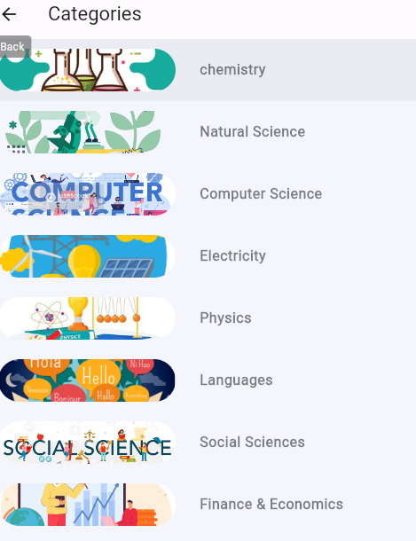
  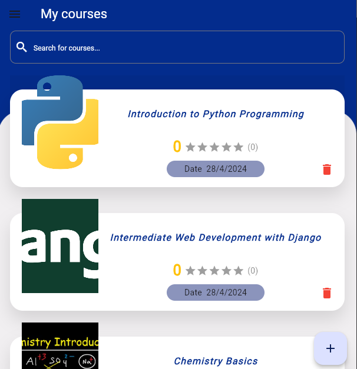
</p>

---

### 🔹 Admin Panel

<p align="center">
  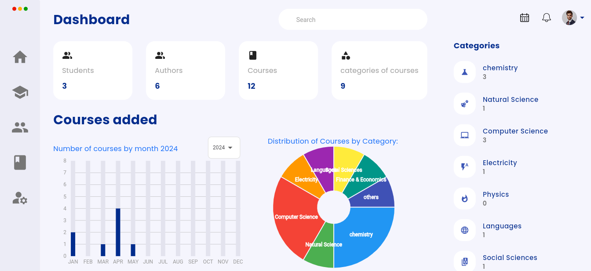
  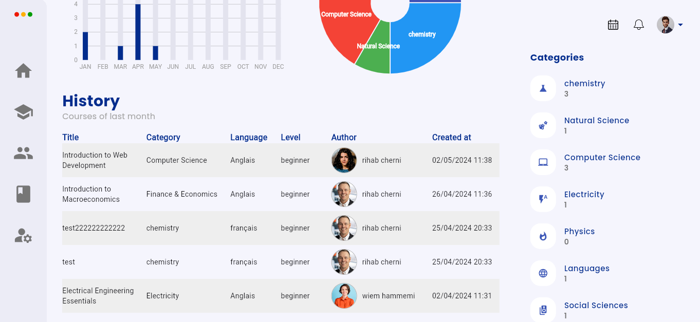
    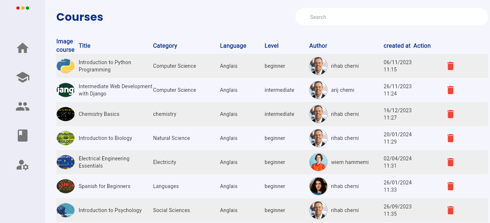
  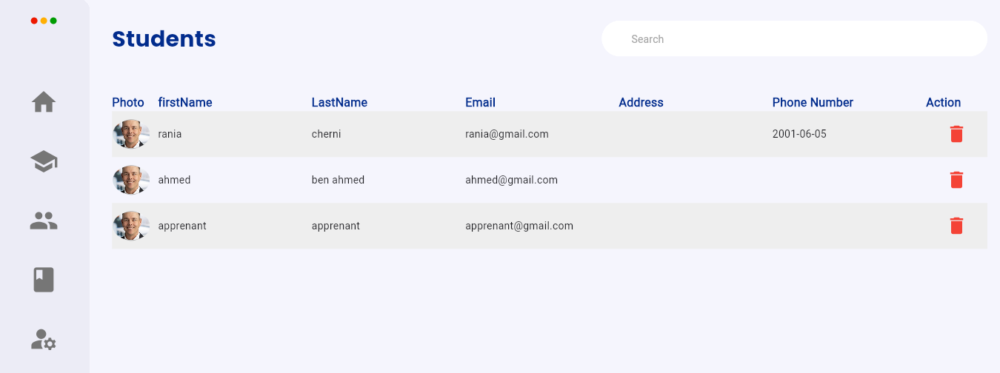
  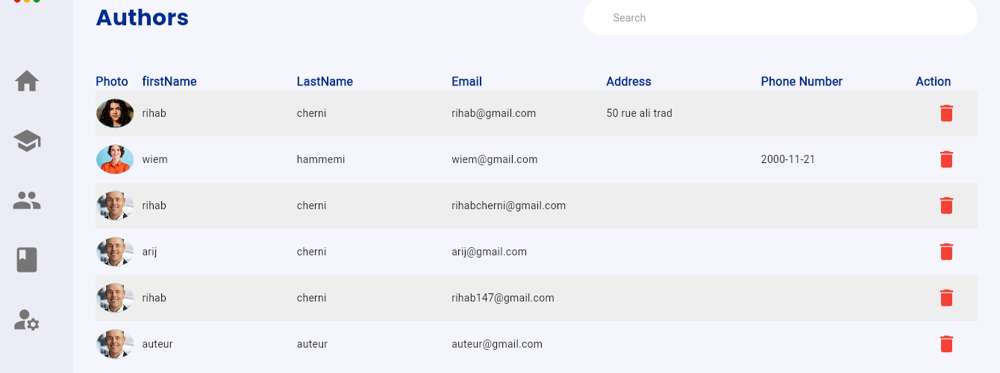
</p>